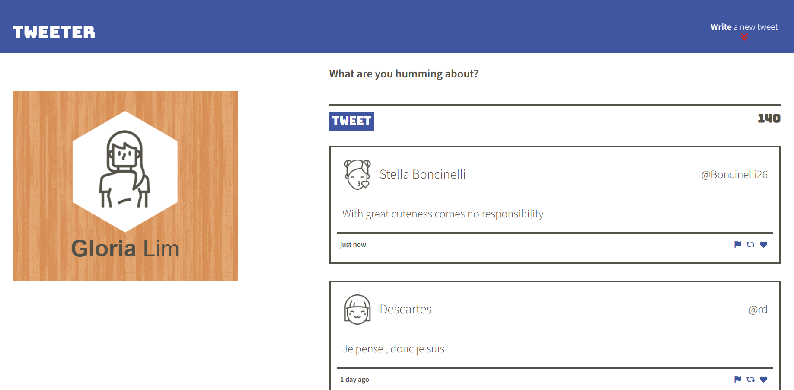
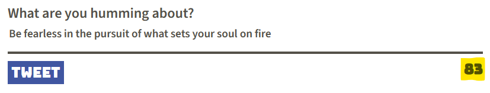
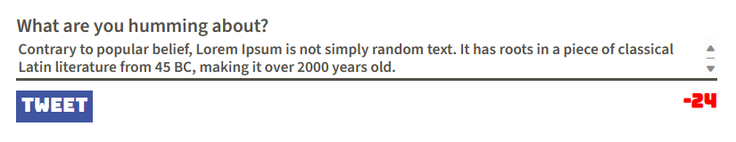
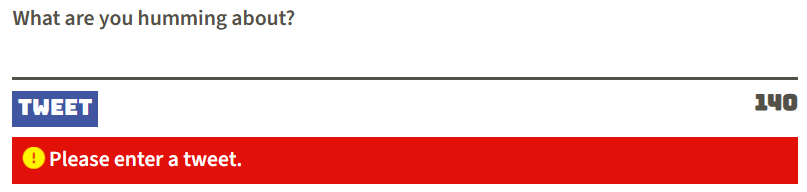

# Tweeter Project

Tweeter (aka Twitter clone) is a dynamic and responsive Single Page Application (SPA) built with HTML, CSS, JS, jQuery and AJAX.

## Using Tweeter
Tweeter homepage layout will depend on your device.

#### Desktop Layout (1024px and above):
  

#### Smaller Screens (Under 1024px):
  

- Users can create short posts of up to 140 characters and have them append to the main page.
   
- The tweet will contain the avatar image, name of user as well as time since it was posted. 
   
- The remaining characters avaliable is indicated at the bottom right corner. This will turn red when 140 characters is exceeded. 
   
- Empty Tweets will not be posted.
   
- Posts are sequential, with the most recent posts appearing at the top of the page.

## Steps to clone and run locally

1. [Create](https://docs.github.com/en/repositories/creating-and-managing-repositories/creating-a-repository-from-a-template) a new repository using this repository as a template.
2. Clone your repository onto your local device.
3. Install dependencies using the `npm install` command.
3. Start the web server using the `npm run local` command. The app will be served at <http://localhost:8080/>.
4. Go to <http://localhost:8080/> in your browser.

## Dependencies

- Node 5.10.x or above
- Express
- Chance
- md5
- body-parser

## Development Dependencies

- Nodemon

## Additional Features

- Responsive design using Media queries in CSS.
`(Zoom in and out with CTRL/CMD and +/- to test the responsive design)`
- SASS components for maintainable CSS.

